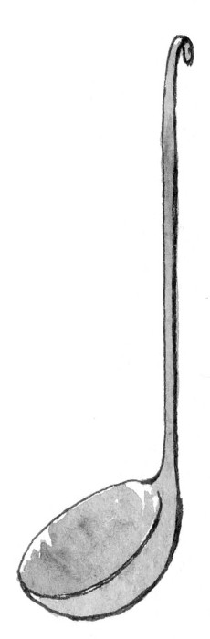
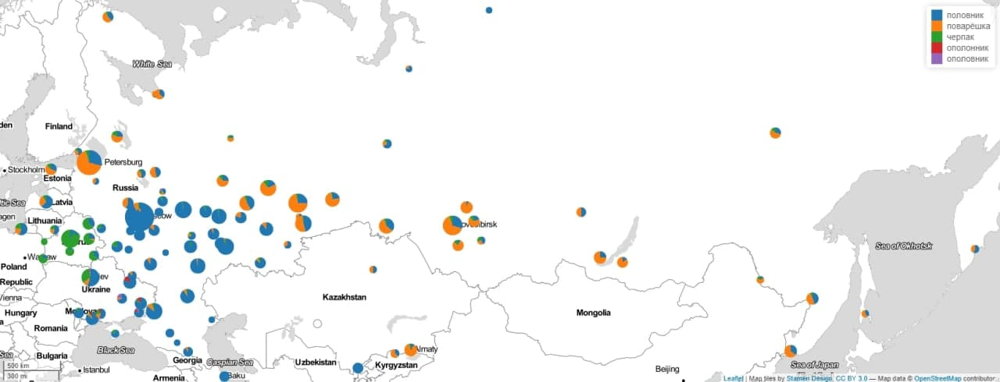
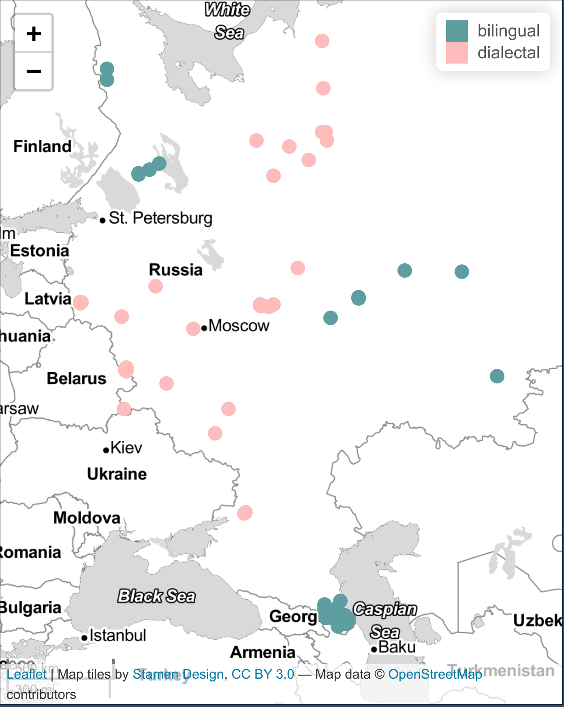
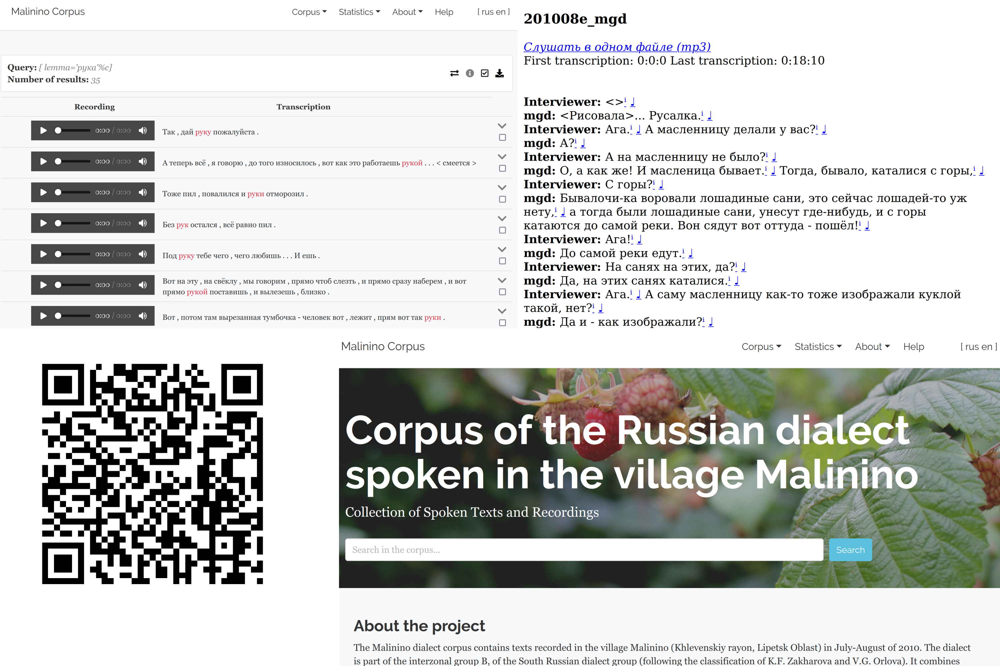

```{r, include=FALSE}
knitr::opts_chunk$set(echo = FALSE, warning = FALSE, message = FALSE, dev='cairo_pdf')
library(tidyverse)
library(tidytext)
theme_set(theme_minimal()+theme(legend.position = "bottom", text = element_text(size = 20)))
```

#  Лингвистика: мифы и реальность

## \#тыжлингвист

>- умеет читать на всех письменностях мира
>- знает все языки на свете
>- умеет распознавать каждый язык на слух 
>- может рассказать о происхождении каждого слова
>- пишет без ошибок и знает все правила орфографии
>- не знает математики и программирования 
>- \Large все вышеперечисленное, конечно, неправда

## Лингвистика

- прескриптивная \pause
- вся остальная (дескриптивная)
    - каталогизация языкового разнообразия, описание языковых контактов
    - исследования грамматики языка
    - исследования распределения грамматических особенностей в языках мира
    - исследования когнитивных способностей человека и других животных, связанных с языком
    - исследования в области синтеза и распознования речи и языка
    - создание компьютерных инструментов для решения самых разных задач
    - вспомогательные инструменты лингвистического исследования и документации
    - корпусная лингвистика
    - исследования в области NLP, языковых моделей и т. п. 
    - симуляционные модели в лингвистике

## Прескриптивная vs. дескриптивная лингвистика

Назовите, пожалуйста, что изображено на картинке.

(рисунок Тани Пановой)



## Прескриптивная vs. дескриптивная лингвистика

Это часть опроса Ивана Левина:



#  Обо мне

##  Обо мне

* полевые исследования (29 поездок)
* фонетист, фонолог, квантитативный лингвист
* езжу на Кавказ
* преподаю статистику и R (язык программирования)
* написал несколько лингвистических пакетов для R
    * [`lingtypology`](https://ropensci.github.io/lingtypology/)
    * [`phonfieldwork`](https://docs.ropensci.org/phonfieldwork/)
    * [`lingglosses`](https://github.com/agricolamz/lingglosses)

# Корпусная лингвистика

## Корпусная лингвистика

Корпусная лингвистика --- это область лингвистики, которая занимается исследованием языковых явлений на материале некоторых собраний языкового материала. В большинтсве случаев это письменные тексты, однако это может быть аудио и даже видео корпус.

Среди корпусов русского языка можно назвать:

- [Национальный корпус русского языка](https://ruscorpora.ru/)
    - более 1.5 млрд слов
    - много подкорпусов (газетный, устный, параллельный, диалектный, поэтический, исторические)
- Google Books Ngram Viewer 
- ...

## *Отложить в ... ящик*

```{r}
library(tidyverse)
library(ngramr)
iz <- ngram(phrases = c("в долгий ящик", "в дальний ящик"), 
            corpus = "ru-2019",
            year_start = 1850)

iz %>% 
  ggplot(aes(x = Year, y = Frequency, colour = Phrase))+
  geom_line()+
  theme_google()+
  labs(caption = "на основе Google Books Ngram Viewer")
```

## Диалектные устные корпуса лаборатории языковой конвергенции

```{r, fig.align='center'}

```

## Диалектные устные корпуса лаборатории языковой конвергенции

```{r, out.width="100%", fig.align='center'}

```

<http://lingconlab.ru/resources.html>

# Использование причастий и деепричастий в устной речи

## Цель работы

- работа по извелечению примеров и разметке примеров была сделана нашим постдоком Светланой Сергеевной Земичевой
- исследовать использование причастий и деепричастий в устной речи на материале диалектных и билингвальных корпусов
- исследовать соотношение литературных и диалектных форм (например, *евши*)
    - диалектные формы на -*ши* могут иметь разные функции, иногда они ведут себя как финитные формы:
    
*Пока делаешь, придёшь --- он уже вставши.* (Макеево, 1953, f)

## Данные


## {}

\LARGE Спасибо за внимание!
