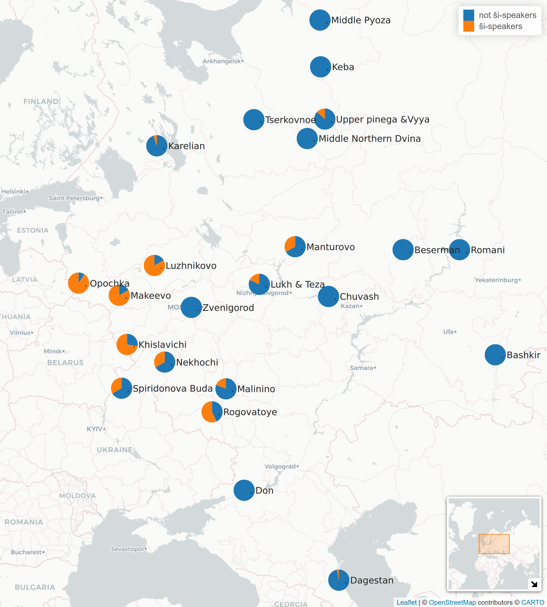
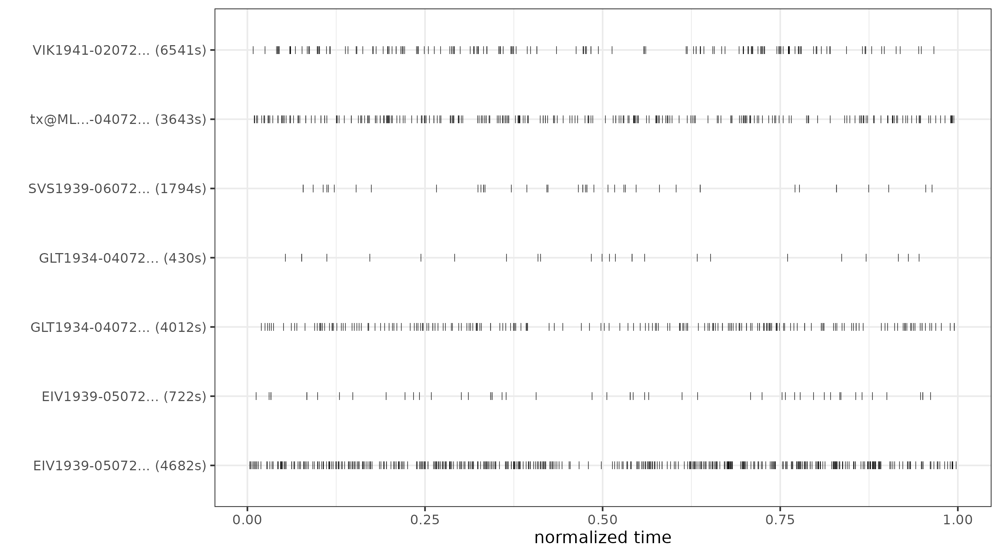
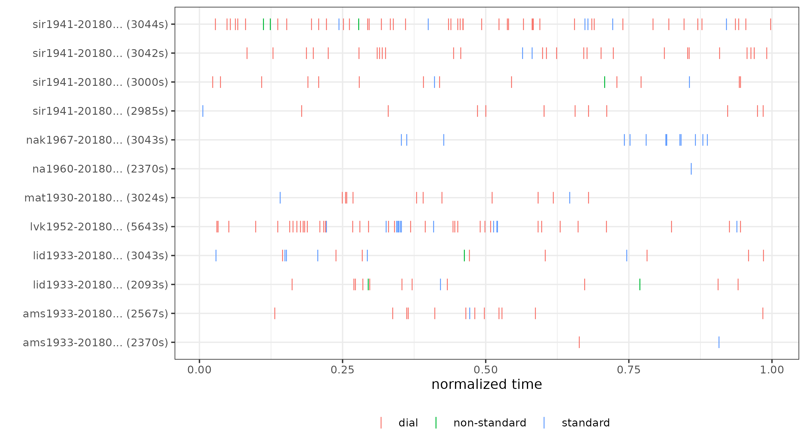
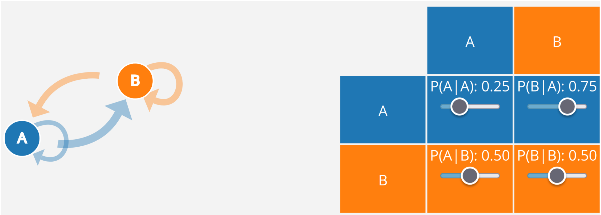

```{r, include=FALSE}
knitr::opts_chunk$set(echo = FALSE, warning = FALSE, message = FALSE, dev='cairo_pdf')
# setwd("/home/agricolamz/work/materials/2023.03.23_math_app")
library(tidyverse)
library(brms)
theme_set(theme_minimal()+theme(legend.position = "bottom", text = element_text(size = 20)))

# load data
readxl::read_xlsx("data/participle_result.xlsx") %>% 
  distinct() %>% 
  filter(!str_detect(tier_name, "other")) %>% 
  mutate(standard = str_remove(standard, "\\s?\\(\\?\\)"),
         standard = str_replace(standard, "non-standard", "dialect"),
         standard = str_replace(standard, "dial$", "dialect"),
         corpus_type = str_extract(corpus, "l2"),
         corpus_type = ifelse(is.na(corpus_type), "диалектный", "билингвальный")) %>% 
  rename(speaker = tier_name,
         form = standard) %>% 
  select(corpus, corpus_type, speaker, education_level_value, form, time_start, time_end, source) ->
  df
```

#  Лингвистика: мифы и реальность

## \#тыжлингвист

>- умеет читать на всех письменностях мира
>- знает все языки на свете
>- умеет распознавать каждый язык на слух 
>- может рассказать о происхождении каждого слова
>- пишет без ошибок и знает все правила орфографии
>- не знает математики и программирования 
>- \Large все вышеперечисленное, конечно, неправда

## Лингвистика

- прескриптивная \pause
- вся остальная (дескриптивная)
    - каталогизация языкового разнообразия, описание языковых контактов
    - исследования грамматики языка
    - исследования распределения грамматических особенностей в языках мира
    - исследования когнитивных способностей человека и других животных, связанных с языком
    - исследования в области синтеза и распознования речи и языка
    - создание компьютерных инструментов для решения самых разных задач
    - вспомогательные инструменты лингвистического исследования и документации
    - корпусная лингвистика
    - исследования в области NLP, языковых моделей и т. п. 
    - симуляционные модели в лингвистике

## Прескриптивная vs. дескриптивная лингвистика

Назовите, пожалуйста, что изображено на картинке.

(рисунок Тани Пановой)


## Прескриптивная vs. дескриптивная лингвистика

Это часть опроса Ивана Левина:


#  Обо мне

##  Обо мне

* полевые исследования (29 поездок)
* фонетист, фонолог, квантитативный лингвист
* езжу на Кавказ
* преподаю статистику и R (язык программирования)
* написал несколько лингвистических пакетов для R
    * [`lingtypology`](https://ropensci.github.io/lingtypology/)
    * [`phonfieldwork`](https://docs.ropensci.org/phonfieldwork/)
    * [`lingglosses`](https://github.com/agricolamz/lingglosses)

# Корпусная лингвистика

## Корпусная лингвистика

Корпусная лингвистика --- это область лингвистики, которая занимается исследованием языковых явлений на материале некоторых собраний языкового материала. В большинтсве случаев это письменные тексты, однако это может быть аудио и даже видео корпуса.

Среди корпусов русского языка можно назвать:

- [Национальный корпус русского языка](https://ruscorpora.ru/)
    - более 1.5 млрд слов
    - много подкорпусов (газетный, устный, параллельный, диалектный, поэтический, исторические)
- Google Books Ngram Viewer 
- ...

## *Отложить в ... ящик*

```{r}
library(ngramr)
iz <- ngram(phrases = c("в долгий ящик", "в дальний ящик"), 
            corpus = "ru-2019",
            year_start = 1850)

iz %>% 
  ggplot(aes(x = Year, y = Frequency, colour = Phrase))+
  geom_line()+
  theme_google()+
  labs(caption = "на основе Google Books Ngram Viewer")
```

## Диалектные устные корпуса лаборатории языковой конвергенции

```{r, fig.align='center'}
knitr::include_graphics("images/03_corpora.png")
```

## Диалектные устные корпуса лаборатории языковой конвергенции

```{r, out.width="100%", fig.align='center'}
knitr::include_graphics("images/04_corpus.png")
```

<http://lingconlab.ru/resources.html>

# Использование причастий и деепричастий в устной речи

## Идея исследования

- работа по извелечению примеров и разметке примеров была сделана нашим постдоком Светланой Сергеевной Земичевой
- исследовать использование причастий и деепричастий в устной речи на материале диалектных и билингвальных корпусов
- исследовать соотношение литературных и диалектных форм (например, *евши*)
    - диалектные формы на -*ши* могут иметь разные функции, иногда они ведут себя как финитные формы:
    
*Пока делаешь, придёшь --- он уже вставши.* (Макеево, 1953, f)

- С. С. Земичева изначально выделила три типа форм:
    - стандартные: *вышедший*, *сделанный*, *сделав*
    - диалектные: *вышедши*, *забывши*
    - промежуточные: *выпивши*, *доёный*

## Данные: `r nrow(df)` наблюдений

- `r df %>% count(corpus) %>% nrow()` корпусов, `r df %>% count(speaker) %>% nrow()` носителей 

```{r}
library(inspectdf)
df %>% 
  select(-source) %>% 
  inspect_cat() %>% 
  mutate(col_name = factor(col_name, levels = c("speaker",
                                                "corpus", 
                                                "corpus_type", 
                                                "education_level_value", 
                                                "form"))) %>% 
  show_plot()+
  labs(title = "")
```

## Данные: географическое распределение

```{r, out.width="100%", fig.align='center'}

```

## Есть ли зависимость между образованием и формой?

Предсказания байесовской логистической регрессии со смешанным эффектами (80% доверительный интервал):

```
form ~ education + (1|corpus/speaker)
```

```{r fit_form_by_education, cache=TRUE, include=FALSE}
df %>% 
  filter(str_detect(corpus, "dialect_"),
         !is.na(education_level_value)) %>%
  mutate(form = ifelse(form == "standard", 0, 1)) %>% 
  brm(form~education_level_value+(1|corpus/speaker), family = bernoulli(), data = ., cores = 15) ->
  fit_dial
```

```{r, fig.height=6}
conditional_effects(fit_dial,
                    prob = 0.8,
                    effects = c("education_level_value"))
```

## А как эти формы расположены во времени?

Использование *вот* в донском корпусе:

```{r, out.width="100%", fig.align='center'}

```

## А как эти формы расположены во времени?

Использование причастий/деепричастий в корпусе Лужникова (разметка С. С. Земичевой):

```{r, out.width="100%", fig.align='center'}

```

## А как эти формы расположены во времени?

Может быть можно попробовать смоделировать вероятность перехода от диалектной формы в недиалектную и наоборот?

```{r, out.width="100%", fig.align='center'}

```

## Прайминг

Праймингом в лингвистике называют эффект, когда говорящие повторяют форму/вариант, которую была использована перед анализируемым речевым актом. Очень походит на эффект якоря или эффект привязки.  

## Прайминг?

Посмотрите на `lvk1952`:

```{r, out.width="100%", fig.align='center'}

```

## Прайминг

`lvk1952`: Это полоса от пожарных, это у нас тут тоже **пропахано**, это от пожаров. 

`Interviewer`: А почему такой полосы не **пропахано** в Ситниково или вот в Лужниково? 

`lvk1952`: Не **пропахано**? В Лужникове есть, вот от нас идешь - у складу удобрения **пропахано**.  Да, ну а там тогда не знаю.  Не, там с Ситникова идешь, вот как с Ситникова значит, на правой стороне-то, эво тут з мосту перейдешь, поднимешься, там тоже **пропахано**! Это от пожаров, это каждый год пропахивают у нас.  Тут всё **пропахано**, там за деревней **пропахано**, там **пропахано**, Хорёво там, это всё **опахано**  Да, это... чё, трава-то, загорится, ее же, вон у нас вот трава когда загорелась - один, два, три, четыре дома. Сразу сгорели. 

# Марковский процесс

## Марковский процесс

Марковская цепь --- это одна из популярных семей стохастических процессов, которая описывает переход из разных состояний. Их часто представляют в виде графа и матрицы переходов:

```{r, out.width="100%", fig.align='center'}

```

- значения в строчках должны суммироваться до 1

## Марковский процесс на примере одного носителя

Возьмем носителя `sir1941` и проанализируем ее 139 форм:

```{r}
library(markovchain)
df %>% 
  filter(speaker == "sir1941")  %>% 
  pull(form) %>% 
  markovchainFit() ->
  mcfit_sir1941

mcfit_sir1941$estimate
```

## Для каждого носителя из корпуса Лужниково

```{r}
df %>% 
  filter(corpus == "dialect_opochka") %>% 
  mutate(education_level_value = ifelse(is.na(education_level_value), "", education_level_value),
         speaker = str_c(speaker, "\n", education_level_value)) ->
  luzhnikovo

map_dfr(unique(luzhnikovo$speaker), function(i){
  luzhnikovo %>% 
    filter(speaker == i) %>% 
    pull(form) ->
    for_mc
  markovchain::markovchainFit(data = for_mc)$estimate@transitionMatrix %>% 
    as_tibble(rownames = "from") %>%
    pivot_longer(names_to = "to", values_to = "pr", -from) %>% 
    mutate(person = i)
}) ->
  result

result %>% 
  filter(!str_detect(person, "na1960")) %>% 
  ggplot(aes(to, from))+
  geom_tile(aes(fill = pr), colour = "white") +
  geom_text(aes(label = str_c(round(pr*100), "%")), colour = "white") +
  scale_fill_gradient(low = "lightblue", high = "navy")+
  facet_wrap(~person)+
  theme(legend.position = "right")
```

## Обобщение по всем корпусам?

- Хотелось бы чтобы можно было делать иерархические марковские цепи, аналогичные нашей регрессии (носитель, вложен в корпус). 
- Кроме того, хотелось бы делать поправку на количество единиц для анализа.
>- Вроде это должно покрываться иерархическими марковскими моделями, но я не нашел их реализацию, которую бы мне подходила, так что я заменил все регрессией 

## Обобщение по всем корпусам?

Предсказания байесовской логистической регрессии со смешанным эффектами (80% доверительный интервал):

```
form ~ education + previous form + (1|corpus/speaker)
```

```{r fit_dial_lag, cache=TRUE, include=FALSE}
df %>% 
  filter(str_detect(corpus, "dialect_"),
         !is.na(education_level_value)) %>%
  arrange(corpus, speaker, source, time_start) %>% 
  mutate(lag_form = lag(form)) %>% 
  mutate(form = ifelse(form == "standard", 0, 1)) %>%
  brm(form~lag_form+education_level_value+(1|corpus/speaker), family = bernoulli(), data = ., cores = 15) ->
  fit_dial_lag
```

```{r, fig.height=6}
conditional_effects(fit_dial_lag,
                    prob = 0.8,
                    effects = c("education_level_value:lag_form"))
```

## Выводы

- Причастия и деепричастия встречаются в устной речи чаще, чем мы думаем
- Вариативность всюду
- Их можно пытатсья моделировать стохастическими моделями разной сложности
- Носители диалектных форм очень разнородны, может быть и не надо пытаться строить какую-то обобщающую модель?

## {}

\LARGE Спасибо за внимание!
